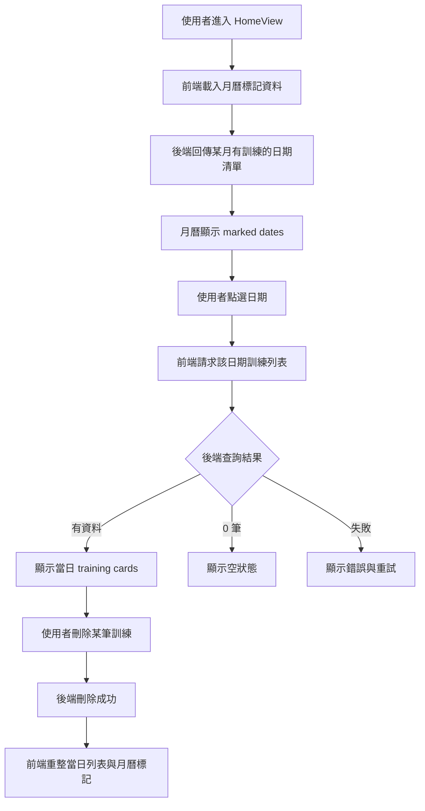
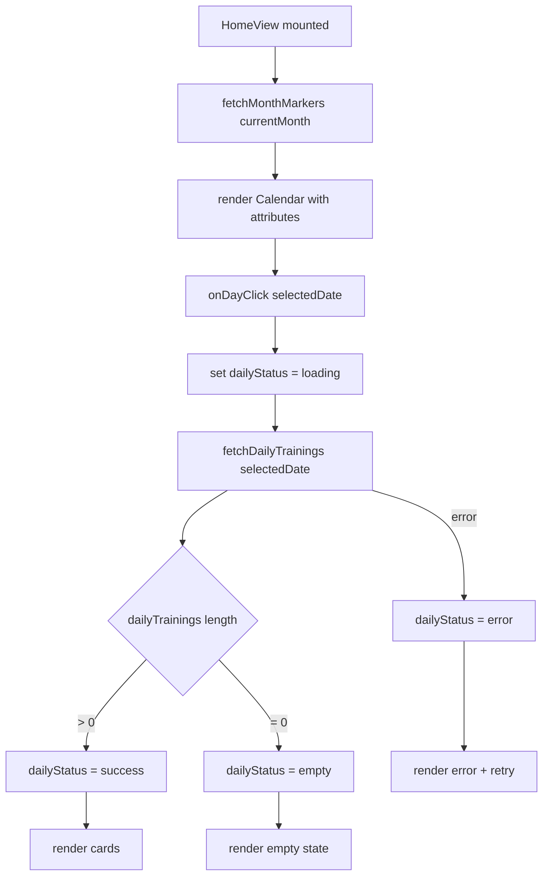
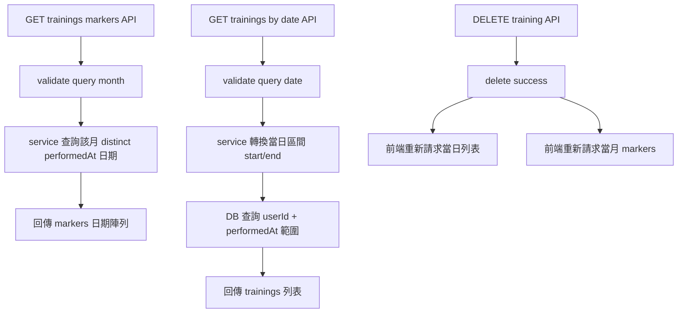

## 目標

把 HomeView 改成「先看月曆，再看當日訓練」，並且讓前後端資料流清楚、可分階段落地。

## 前端套件決策

本方案使用 v-calendar。

安裝指令：

```bash
npm install v-calendar@next @popperjs/core
```

## 整體流程（端到端）



## 前端流程圖（Vue + v-calendar）



## 後端流程圖（API + Service + DB）



## 前端狀態設計（白話）

最少要有這些狀態：

1. selectedDate：目前點了哪一天。
2. currentMonth：月曆目前顯示哪個月份。
3. markedDates：這個月哪些日期有訓練。
4. dailyTrainings：選定日期的卡片資料。
5. dailyStatus：idle/loading/success/empty/error。
6. errorMsg：API 失敗時的訊息。

思考原則：

1. 月曆只關心 markedDates。
2. 卡片只關心 dailyTrainings。
3. 一切請求由 HomeView 協調，不讓展示元件自己打 API。

## API 規劃建議（給後端對齊）

### 1) 取得某月有訓練日期

- Method: GET
- Path: /trainings/markers
- Query: month=YYYY-MM
- Response data 範例：

```json
{
  "month": "2026-04",
  "dates": ["2026-04-01", "2026-04-07", "2026-04-23"]
}
```

### 2) 取得某日訓練列表

- Method: GET
- Path: /trainings/by-date
- Query: date=YYYY-MM-DD
- Response data 範例：

```json
{
  "date": "2026-04-23",
  "trainings": []
}
```

## 實作順序（建議分 4 階段）

1. 導入 v-calendar 並完成月曆基本渲染。
2. 串接 markers API，讓有訓練日期可被標示。
3. 串接 by-date API，點日期後載入當日卡片。
4. 補刪除後同步刷新（日列表 + 月標記）。

## 驗收清單

1. Home 開啟後先看到完整月曆。
2. 月曆可清楚標示有訓練日期。
3. 點選任一日期後，顯示該日資料或 0 筆空狀態。
4. API 失敗時可重試。
5. 刪除訓練後，當日卡片與月曆標記都會更新。
6. 手機與桌面都可操作。

## 風險與注意事項

1. 時區邊界：需明確定義以哪個時區判定日期。
2. 資料量成長：markers API 應避免回傳整年全資料。
3. 狀態同步：刪除後務必同步重抓兩份資料（day + month）。
4. 使用者心智：首頁應預設月曆優先，不再先塞滿全部卡片。
